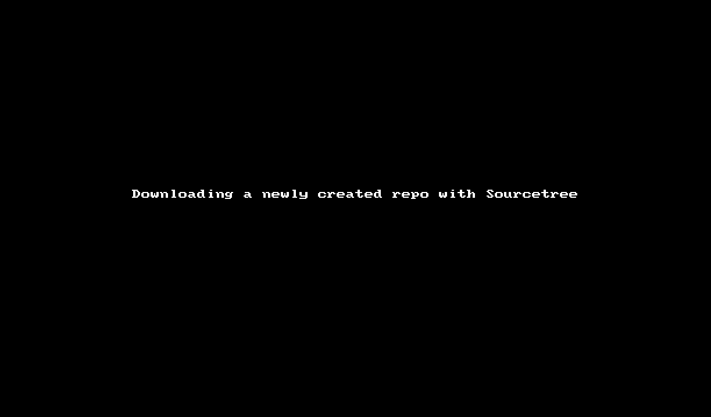

# Setting up your remote repository

At the time I'm writing this, there are two really well-known web
services for people to use as a remote repository:

* [Github](https://github.com)
* [Bitbucket](https://bitbucket.com)
* [Gitlab](https://gitlab.com)

They are nearly identical in the service they offer, with bitbucket
and gitlab offering free private repositories. With Github, you have
to pay for private repositories.

Whichever service you use, you'll need to follow the instructions on that
site to create a remote repository. When you've done that, you'll be
given an identifier for the remote that you'll need to make note
of. The remote identifier will look something like this:

* `git@github.com:gdiminneapolis/doggie_diner_brochure_site.git`
* `git@bitbucket.org:tamouse/small-other-project.git`

## Setting the remote origin

Back on your own computer, head back to your project's working
directory:

    cd ~/Projects/doggie_diner_brochure_site

Enter the following command to set the remote origin:

    git remote add origin git@github.com:gdiminneapolis/doggie_diner_brochure_site.git

(Assuming that's the remote repository name.)

## First push

Now you can push the current tip of your working branch out to the
remote repo:

    git push -u origin HEAD

The `-u` option tells git to link the local branch to the remote
branch. Subsequently you'll be able to just type:

    git push

## Starting on the remote service

An alternative in many cases is to start a project by creating your
remote repository **FIRST** rather than after you've built the project
locally. This is actually a good way to go if you are not comforatble
using the command line much.

### Creating a Github remote

Log into https://github.com with your Github user and password. On the
right side of the top navigation bar is a `+` sign, if you click it
you get a drop-down menu allowing you to create a new repository.

When the new repository dialog screen opens, give your new remote
repository a name (only letters, numbers, and no spaces).

Give it a one-line description, letting people know what this
repository is for.

You can create unlimited free Public repos, but you have to pay for
private repos, so select accordingly. If you are building an app for
sale, or a project for commercial reasons, you'll likely want to keep
it private.

Check on the box to initialize the repostory with a README. The README
will have the desciption inserted by default.

You may want to add a `.gitignore` file, it makes keeping junk out of
your repo easier.

You may want to add a license as well. If you are creating an
open-source project, you have several options. THe most popular right
now seems to be the MIT license.

Then click on the `Create Repository` button.

You should now have a remote repository. You can download it from
there using the Github Desktop client, SourceTree, or other means of
your choice.

#### Downloading with Sourcetree

From the Github repository page, if you click on the green `Clone or
Download` button, you can then launch a clone onto your local machine
by clicking on `Open in Desktop`. If you have installed SourceTree as
your default application, it will automatically launch and let you
create the local repository.

